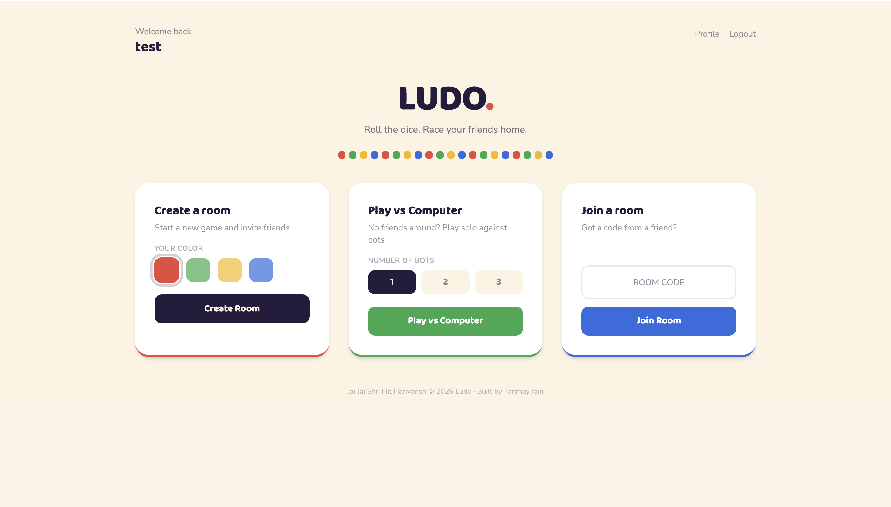
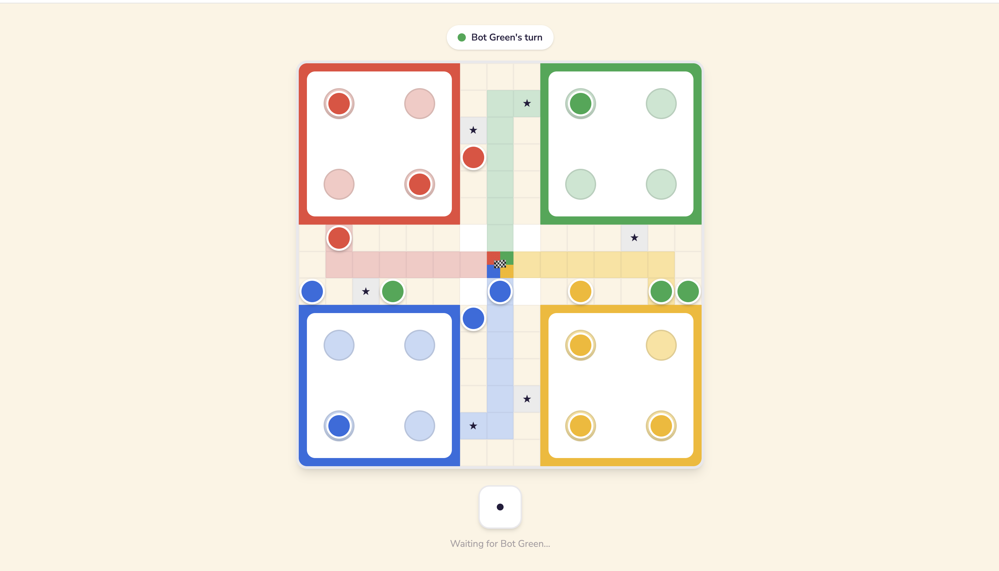
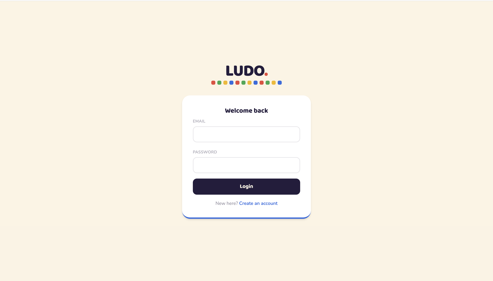
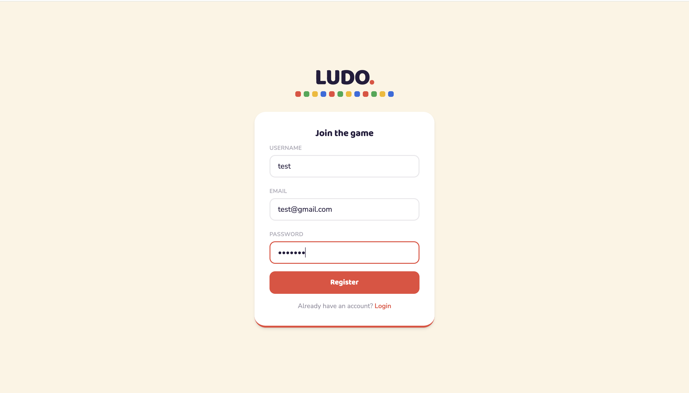
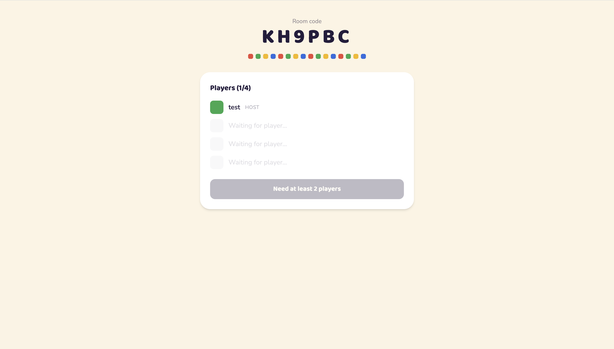
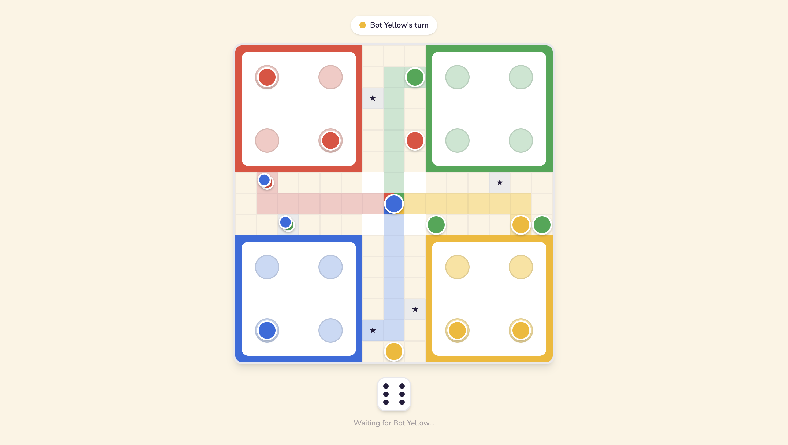

# 🎲 Online Ludo

A full-stack, real-time multiplayer Ludo game — play the classic board game with friends from anywhere using a shareable room code, or play solo against AI bots. Built end-to-end as a portfolio project to demonstrate full-stack architecture, real-time systems, and game-logic design.

**[Live Demo](https://online-ludo-frontend.onrender.com)** · **[Repo](https://github.com/TanmayJ17/online-ludo)**

> Hosted on free-tier infrastructure — the backend spins down after inactivity, so the first request after a while may take 30–50 seconds to wake up. Gameplay after that has some inherent network latency (separate backend and database hosts), but is fully functional.

<!-- Add a screenshot or GIF of the game board here -->



---

## Features

- **Accounts & auth** — JWT-based registration/login, Bearer token auth on every protected route


- **Rooms via shareable code** — create a room, share a 6-character code, friends join instantly

- **Play vs Computer** — no friends online? Play solo against 1–3 AI bots, any starting color
- **Real-time gameplay** — dice rolls, token moves, captures, and turn changes sync live across every connected player via Socket.IO
- **Full Ludo rules engine, built from scratch** — no third-party game library:
  - Legal move detection (can't move without a 6 out of home, can't overshoot the finish)
  - Captures on non-safe squares, with an extra turn on a successful capture
  - Extra turn on rolling a 6, with a 3-in-a-row forfeit-turn penalty
  - Win detection and automatic final rankings once a player finishes all 4 tokens

- **Turn timer & auto-forfeit** — a player who doesn't roll within 60 seconds has their turn auto-skipped; after 3 missed turns in a row, they're forfeited from the match entirely
- **Bot AI** — priority-based decision engine: capture an opponent > finish a token > avoid a move that exposes a token to capture next turn > escape home on a 6 > advance the furthest token
- **Live win/loss stats** — per-user wins and games-played, updated automatically when a match ends, visible on a dedicated profile page
- **Admin dashboard** — role-gated view of all games and users (read-only)
- **Animated board** — step-by-step token movement animation, dice roll flicker, safe-square token stacking, all rendered on a custom-built 15×15 board (no image assets)
- **Responsive** — playable on both desktop and mobile

---

## Tech Stack

**Backend:** Node.js, Express, MongoDB + Mongoose, Socket.IO, JWT, bcrypt
**Frontend:** React, Vite, React Router, Tailwind CSS v4, Axios, Socket.IO client
**Hosting:** Render (backend web service + frontend static site), MongoDB Atlas

---

## Architecture Notes

A few design decisions worth calling out (useful context if you're reading the code or discussing it in an interview):

- **Socket.IO + Express in one process, wired via a lazy `require`.** Controllers emit events (`diceRolled`, `tokenMoved`, `turnTimeout`, etc.) after mutating game state, but import `io` from `app.js` *inside* each handler rather than at the top of the file — importing at module load time creates a circular dependency (`app.js` → routes → controller → `app.js`) that silently resolves to `undefined`.
- **A single shared `finalizeIfGameOver` service** determines whether a game has ended (checks remaining active players, assigns final ranks, updates every player's stats via `Promise.all`) and is called from every place a turn can end — human moves, timeouts, and bot moves alike — avoiding duplicated win-condition logic across multiple trigger paths.
- **Bots are real `User` documents**, flagged `isBot: true` and seeded once via `scripts/seedBots.js`. This means every existing piece of code that already worked for human players — populate calls, turn-checking, stats updates — works completely unchanged for bots too; a bot is just a "user" whose moves come from the server itself instead of an HTTP request.
- **In-memory turn timers**, keyed by room code. This is a deliberate simplification for a single-process deployment; it would need to move to a shared store (e.g. Redis) to work correctly behind multiple server instances.
- **Board rendering uses one coordinate lookup table**, mapping every possible `boardPosition` (−1 home yard, 0–51 shared track, 52–57 private home stretch, 58 finished) to a `{row, col}` on a 15×15 CSS grid — mirroring the same numbering the backend's game logic already uses for collision/capture detection, so the visual board and the game state never disagree about where a token is.
- **Client-side fetch race protection.** Once deployed to real, non-trivial network latency, out-of-order API responses became a real risk (e.g. a slow, stale `/game/state` response arriving *after* a newer one and overwriting fresh data with old). A request-ID guard ensures only the response from the most recently issued fetch is ever applied to state, regardless of the order responses actually arrive in — diagnosed with timestamped console logging against the live deployment rather than guessed at.

---

## Getting Started

### Prerequisites
- Node.js (v18+ recommended)
- A MongoDB instance (local or [MongoDB Atlas](https://www.mongodb.com/atlas))

### 1. Clone the repo
```bash
git clone https://github.com/TanmayJ17/online-ludo.git
cd online-ludo
```

### 2. Backend setup
```bash
cd backend
npm install
```
Create a `.env` file in `backend/`:
```env
PORT=4444
MONGO_URI=your_mongodb_connection_string
JWT_SECRET=your_jwt_secret
```
Seed the bot accounts (one-time, required for "Play vs Computer" to work):
```bash
node scripts/seedBots.js
```
Run the server:
```bash
node app.js
# or, for auto-restart on changes:
npx nodemon app.js
```

### 3. Frontend setup
```bash
cd frontend
npm install
npm run dev
```
The frontend expects the backend at `http://localhost:4444` by default — update `src/api/axios.js` and `src/context/SocketContext.jsx` if you're running the backend on a different port or host.

### 4. Play
Open the frontend URL (typically `http://localhost:5173`), register two accounts (e.g. in a normal window and an incognito window) to play with a friend, or just register one and try "Play vs Computer" to test solo.

---

## Deployment

This project is deployed on Render (both backend and frontend) with MongoDB Atlas as the database:

- **Backend**: Render Web Service, root directory `backend`, build command `npm install`, start command `node app.js`, with `MONGO_URI`, `JWT_SECRET`, and `PORT` set as environment variables.
- **Frontend**: Render Static Site, root directory `frontend`, build command `npm install && npm run build`, publish directory `dist`. Requires a rewrite rule (`/*` → `/index.html`) so client-side routes work on refresh/direct link.
- **Database**: MongoDB Atlas free tier, with network access opened to `0.0.0.0/0` (Render's free tier doesn't have fixed outbound IPs to whitelist individually).
- CORS on the backend is restricted to the deployed frontend's exact origin.

---

## Project Structure

```
online-ludo/
├── backend/
│   ├── controllers/       # Route handlers (auth, game, admin)
│   ├── models/             # Mongoose schemas (User, Game)
│   ├── routes/              # Express route definitions
│   ├── middlewares/    # JWT auth, admin role check, socket auth
│   ├── services/           # Game logic, turn timer, win/finalize logic, bot AI
│   ├── scripts/             # One-time setup scripts (bot account seeding)
│   ├── constants/         # Board layout constants (track length, safe squares, start positions)
│   └── app.js                # Express + Socket.IO server entry point
└── frontend/
    └── src/
        ├── pages/            # Login, Register, Lobby, WaitingRoom, GameBoard, Admin, Profile
        ├── components/  # Board, Token, Dice, ProtectedRoute, AdminRoute, CellTrack
        ├── context/        # AuthContext, SocketContext
        ├── constants/     # Frontend board coordinate lookup, color palette
        └── api/               # Axios instance with auto-attached auth header
```

---

## Known Limitations

- Turn timers are in-memory, so they won't survive a server restart or scale across multiple server instances without additional work (see Architecture Notes above).
- Free-tier hosting introduces noticeable latency (separate backend/database hosts, cold starts after inactivity) — functional but not instant.
- On very small screens, two or more tokens stacked on the same safe square can be tight to tap precisely.
- Admin routes are read-only by design — no in-app moderation actions (e.g. force-ending a game) yet.

---

## License

ISC
